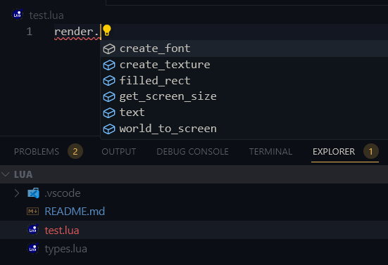

# WeaveSnippet

### How to install?

-   Download lua-language-server:

    -   [Visual Studio Code](https://marketplace.visualstudio.com/items?itemName=sumneko.lua)

-   Download [types.lua](https://github.com/MasedMSD/WeaveSnippet/blob/main/types.lua) and put it into `weave/lua`
-   Done!

### How it looks?

### Todo

-   [ ] Generics Support
-   [ ] Description for methods
